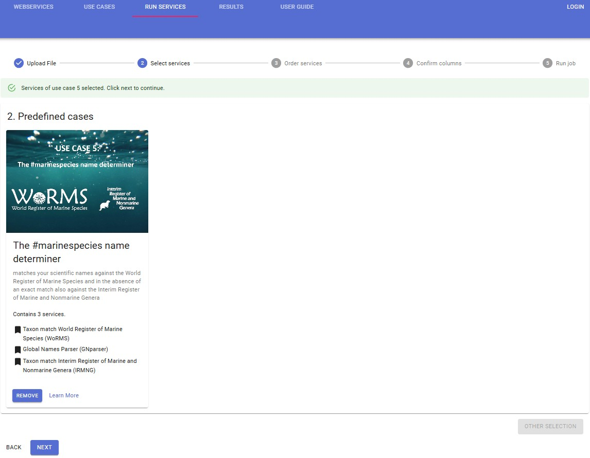
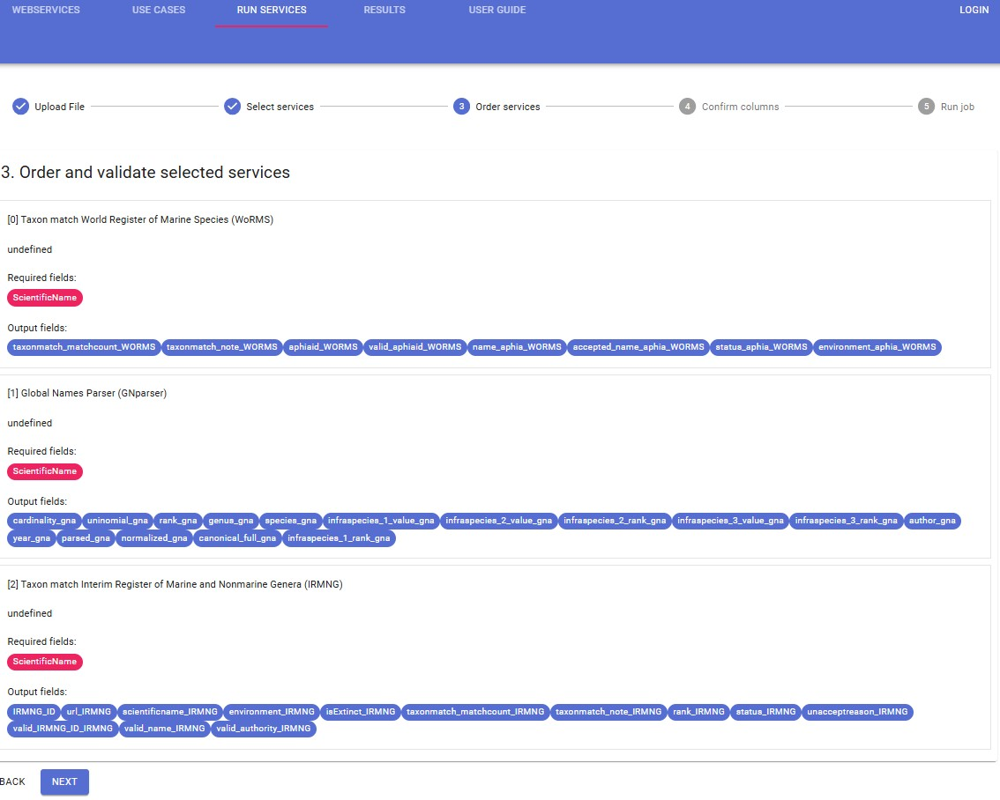
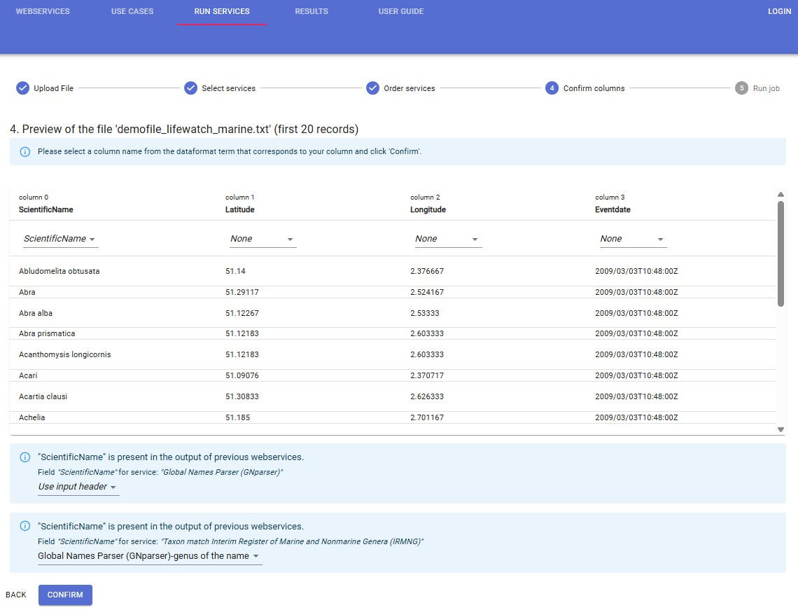

# Use Cases

[//]: <> ## Use Case 4: Quality Control of Biodiversity Datasets 

[//]: <> ### Set-up: You upload an entire data set and want to perform a series of quality control steps on your data

[//]: <> - Dataset formatted in the **OBIS scheme**: choose web service 'Check OBIS file'

[//]: <>   This web service checks which mandatory fields are present or missing, and checks if values are missing in the mandatory fields. This web service also generates a map and validates the coordinates (sea-land) and the dates. Furthermore, this web service performs a taxon match with the World Register of Marine Species (WoRMS).
  

[//]: <> - Dataset in the **LifeWatch data format**: choose web service 'Data format validation'

[//]: <>   This web service checks which fields do not belong to the data format, and validates the values in the fields longitude, latitude and eventdate. To further validate the content of the data set, you can choose additional data services. First, you can perform a taxonomic quality control through the web service 'Taxon match'. This web service checks if the uploaded taxon names are recorded in existing taxonomic databases and nomenclatures such as the World Register of Marine Species (WoRMS), the Catalogue of Life (CoL), the Integrated Taxonomic Information System (ITIS), Index Fungorum (IF), the International Plant Names Index (IPNI), the Global Names Index (GNI), the Paleobiology Database (Paleo), and the Pan-European Species directories Infrastructure (PESI).
  
  
[//]: <> If a taxon name is available in these databases, this web service renders, for each database, its ID, its status (accepted or unaccepted) and its accepted name. The web service can match the uploaded taxon names to all taxonomic databases at once or to a selection. For instance, if the dataset contains purely marine taxa, you can select Taxon match World Register of Marine Species (WoRMS) and remove the other taxon matches. Second, you can perform a geographic quality control, i.e. check the coordinates, through the web service 'Show on map'. The output of this web service is a map with the plotted coordinates. Here you can verify very quickly if marine observation points are indeed plotted in marine areas, and terrestrial observation points are indeed plotted on land.

[//]: <> For this use case the order of the selected web services is not relevant. The 'Check OBIS file' web service needs to be performed separately, since the input file for this web service is a dataset in the OBIS scheme (example). The 'Data format validation', 'Taxon match' and 'Show on map' web services can be performed simultaneously. The input file for these web services is a dataset in the LifeWatch data format (example).

[//]: <> ### How to

[//]: <> 1. Upload File

[//]: <> Upload your data file and select the relevant row and column delimiter and decimal symbol. Select the data format: OBIS scheme for 'Check OBIS file' and LifeWatch data format for 'Data format validation', 'Taxon match' and 'Show on map'. Click on 'Next'. 

[//]: <> 

[//]: <> 2. Select services

[//]: <> Select the predefined usecases box. Choose Use Case 4 which contains 3 services : Data format validation, Show on Map and Taxon match Aquacache. Click on 'Select'.

[//]: <> 

[//]: <> 3. Order and validate selected services

[//]: <> For this use case the order of the selected web services is not relevant. Click on 'Next'.

[//]: <> 

[//]: <> 4. Confirm columns

[//]: <> When you click "Next", you are redirected to the preview screen. Make sure that the column containing the scientific name corresponds with a column name from the pick list. Click 'Confirm'.

[//]: <> *Note: if this step does not work, try on a different browser (Firefox, Google Chrome, ... )*

[//]: <> 

[//]: <> 5. Run job

[//]: <> The following message appears:

[//]: <> 

[//]: <> Click on "Results". Your result file will appear at the top of the results table. The result report gives an overview of the requested web services, the results per web service, any errors that might have occurred during the process, and a legend of the added fields in the result file.

[//]: <> 

## Use Case 5: The #marinespecies name determiner 

### Set-up: You upload an entire data set and want to perform name matching against the World Register of Marine Species

- World Register of Marine Species **WoRMS**'

  This web service aims to provide freely online the most authoritative list of names of all marine species ever published. In case an exact match is returned from WoRMS, the Use Case ends, else it tries to resolve the genus by using the Global Names parser.
  

- Global Names parser **GNparser**'

  This web service splits scientific names into their semantic elements with an associated meta information. Parsing is indispensable for matching names from different data sources, because it can normalize different lexical variants of names to the same canonical form. In case the genus can be obtained from the parser, this is used for matching against IRMNG, else the Use Case ends.

- Interim Register of Marine and Nonmarine Genera **IRMNG**'

  This web service aims to provide a machine-addressable system that will discriminate marine from non-marine, and extant from fossil taxa in species lists, either on the basis of their genus alone, or (if required) by the full species binomen. For this use case the genus alone is used.
  
  
If a taxon name is available in WoRMS, this Use Case renders its ID, its status (accepted or unaccepted), its accepted name and its environment. In the absence of an exact match, the Use Case uses the GNparser to get the genus from the data. If a genus is available in GNparser, it is used for matching with IRMNG. If a taxon name is available in IRMNG, this Use Case renders its ID, its status (accepted or unaccepted), its accepted name and its environment.

For this use case the order of the selected web services is relevant. The 'WoRMS' web service needs to be performed first. Depending on the result the 'GNparser' is executed. Finally, the 'IRMNG' webservice can be performed based on the result of the parser.

### How to

1. Upload File

Upload your data file and select the relevant row and column delimiter and decimal symbol. Select the data format: OBIS scheme for 'Check OBIS file' and LifeWatch data format for 'Data format validation', 'Taxon match' and 'Show on map'. Click on 'Next'. 

2. Select services

Select the predefined usecases box. Choose Use Case 'the #marinespecies name determiner' which contains 3 services : WoRMS, GNparser and IRMN. Click on 'Select'.

3. Order and validate selected services

For this use case the order of the selected web services cannot be changed. Click on 'Next'.

4. Confirm columns

When you click "Next", you are redirected to the preview screen. Make sure that the column containing the scientific name corresponds with a column name from the pick list. Click 'Confirm'.

*Note: if this step does not work, try on a different browser (Firefox, Google Chrome, ... )*

5. Run job

The following message appears:

Click on "Results". Your result file will appear at the top of the results table. The result report gives an overview of the requested web services, the results per web service, any errors that might have occurred during the process, and a legend of the added fields in the result file.

